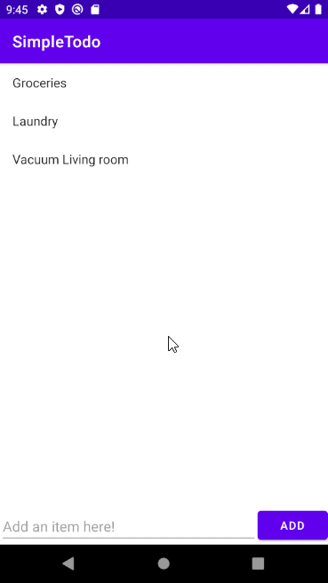

# Project 1 - *Simple Todo*

**Simple Todo** is an android app that allows building a todo list and basic todo items management functionality including adding new items, editing and deleting an existing item.

Submitted by: **Chaz Handa**

Time spent: **7** hours spent in total

## User Stories

The following **required** functionality is completed:

* [x] User can **view a list of todo items**
* [x] User can **successfully add and remove items** from the todo list
* [x] User's **list of items persisted** upon modification and and retrieved properly on app restart

The following **optional** features are implemented:

* [x] User can **tap a todo item in the list and bring up an edit screen for the todo item** and then have any changes to the text reflected in the todo list

## Video Walkthrough

Here's a walkthrough of implemented user stories:

GIF created with [Puush](https://puush.me/).

## Notes

The video walkthroughs were very helpful, but I had to use an alternative method to connect Android Studio with GitHub. 
My credentials would not work properly on the Androis Studio VCS menu for GitHub so I had to make and use a security token.
The first time I used a token the project still failed to upload properly and I had to figure out where to change the credentials 
again because the way shown in the video is only for initial setup.

## License

    Copyright [2021] [Chaz Handa]

    Licensed under the Apache License, Version 2.0 (the "License");
    you may not use this file except in compliance with the License.
    You may obtain a copy of the License at

        http://www.apache.org/licenses/LICENSE-2.0

    Unless required by applicable law or agreed to in writing, software
    distributed under the License is distributed on an "AS IS" BASIS,
    WITHOUT WARRANTIES OR CONDITIONS OF ANY KIND, either express or implied.
    See the License for the specific language governing permissions and
    limitations under the License.
